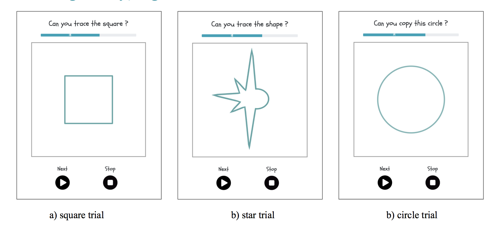
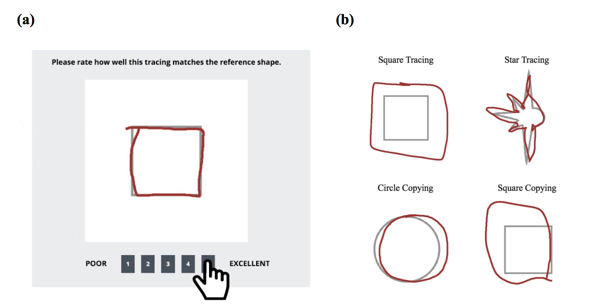

# From Scribbles to Shapes: A Measurement of Visuomotor Ability in Drawing

How do infants who can barely control their limbs grow into children who can produce richly meaningful drawings that express what they are learning about the world? One plausible contributor to this developmental change might be enhanced visuomotor control with age. 

In order to evaluate the developmental change of children’s visuomotor ability, we designed a set of tablet-based tasks to trace and copy primitive geometric shapes and recruited 4880 children, whose age ranges from two to ten, to complete these tasks. 

To evaluate the 9967 tracing and copying images from children, we then developed an automatic procedure to quantify children’s performance and collected adult ratings on a subset of the data to train and validate the model’s evaluation. 

The model is able to reproduce similar evaluations as human raters, and could be used in future research to rate children's visuomotor skills. Using the model on the full dataset, we found an age-related increase in children’s visuomotor ability in drawing.

Paper Link: https://stacks.stanford.edu/file/druid:sh008ff7751/zixian_chai_thesis.pdf

## Dependencies
- Python 2.7
- R

## Depended Projects
- [Autograd Image Registration Laboratory](https://github.com/airlab-unibas/airlab)
- [Kiddraw](https://github.com/brialorelle/kiddraw)

## Usage of the Model

##### 1.  Apply the shape tracing and copying tasks to test children’s visuomotor abilities. 

Reference shapes are located in folder reference. Be careful with image sizes.

##### 2. Apply the affine_reg function in model/evaluation.py script to calculate the shape error and spatial error of each tracing or copying image and output the results as a csv file. 

Construct a csv file which include the following columns:
- post_tran
- translate
- rotate
- scale
- category

##### 3. Input the csv file to the trained model stored in model/model_pred.Rmd to evaluate children’s tracing and copying performance.
